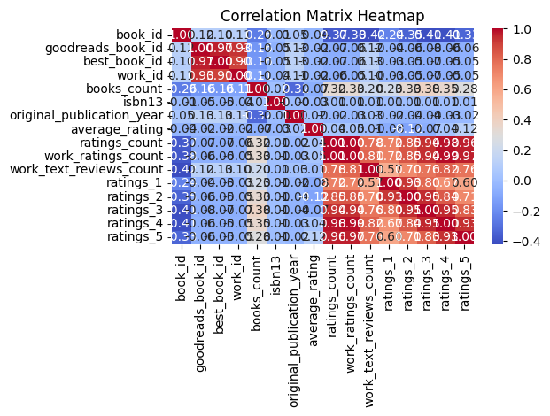

# Automated Analysis Report
# Dataset: goodreads.csv

### Key Stastics
Here are the statistical insights drawn from the provided dataset, summary statistics, and missing values analysis:

### Dataset Overview
- The dataset consists of **10,000 books**, with various attributes including identification numbers, author information, publication year, ratings, and image URLs.
  
### Summary Statistics Insights 
1. **Book Identifiers**:
   - The dataset includes identifiers like `book_id`, `goodreads_book_id`, and `best_book_id`. The mean values indicate a broad range of identifiers available, suggesting a diverse collection of books.

2. **Publication Year**:
   - The `original_publication_year` has a small number of missing values (21). While the dataset covers a significant range of years, further investigation into the distribution of publication years could yield insights into trends in book publishing over time.

3. **Ratings Overview**:
   - The average book rating is approximately **4.1**, indicating that the majority of the books have favorable evaluations by readers.
   - The ratings count (`ratings_count`) and work ratings count (`work_ratings_count`) are high, with average values of about **10,800** and **11,076** respectively, suggesting that there is a good level of engagement and volume of reviews.
   - The distribution of ratings shows a clear preference for higher ratings (4 and 5 stars), evidenced by the average counts for `ratings_4` (~19,965) and `ratings_5` (~23,790). This indicates that readers tend to rate books positively.

4. **Rating Variability**:
   - The standard deviations for the ratings (especially `ratings_5`) are high, indicating significant variability in how different books are rated. This suggests that while certain books are extremely popular and well-received, there are others that receive a much lower rating.

5. **Missing Values**:
   - Several columns have missing values:
     - **ISBN values** have considerable missingness (700 for `isbn` and 585 for `isbn13`). This might limit the ability to uniquely track some books.
     - **Original Title** shows 585 missing entries, which may affect how the books are referenced or cited.
     - **Language Code** has 1,084 missing entries, implying a lack of information that could be significant for analyses related to book language demographics. 

6. **Authors**:
   - There are no missing values in the `authors` column, which is critical as it provides a complete view of the authorship of the books.

### Recommendations
- **Data Cleaning**: Focus on addressing the missing `isbn`, `isbn13`, and `original_title` values, as they may be critical for user searches and bibliographic purposes.
- **Further Analysis**: Investigate the trends in `original_publication_year` to see how book ratings might correlate with the time of publication—this could reveal interesting insights into reader preferences over time.
- **Visualizations**: Consider generating visualizations to represent the distribution of ratings and to assess trends in publication years and author popularity.
- **Language Insights**: Analyze the influence of `language_code` on ratings to understand if certain languages tend to receive higher or lower ratings on average.

### Conclusion
The dataset holds potential for understanding reader preferences and publication trends, but it also requires careful handling of missing data and possibly further insights into specific columns to enhance its usability and accuracy for future analysis.
### Correlation
### General Information

The provided correlation matrix highlights the relationships between various attributes of books, such as ratings, counts, and IDs. It shows how strongly pairs of variables correlate with one another, ranging from -1 (perfect negative correlation) to +1 (perfect positive correlation). In this analysis, we will examine the correlation coefficients to derive significant insights regarding the relationships between book ratings and other relevant metrics. 

### Correlation Matrix

```
                            book_id  goodreads_book_id  best_book_id   work_id  ...  ratings_2  ratings_3  ratings_4  ratings_5
book_id                    1.000000           0.115154      0.104516  0.113861  ...  -0.345764  -0.413279  -0.407079  -0.332486
goodreads_book_id          0.115154           1.000000      0.966620  0.929356  ...  -0.056571  -0.075634  -0.063310  -0.056145
best_book_id               0.104516           0.966620      1.000000  0.899258  ...  -0.049284  -0.067014  -0.054462  -0.049524
work_id                    0.113861           0.929356      0.899258  1.000000  ...  -0.051367  -0.066746  -0.054775  -0.046745
books_count               -0.263841          -0.164578     -0.159240 -0.109436  ...   0.334923   0.383699   0.349564   0.279559
isbn13                    -0.011291          -0.048246     -0.047253 -0.039320  ...   0.010345   0.012142   0.010161   0.006622
original_publication_year  0.049875           0.133790      0.131442  0.107972  ...  -0.038472  -0.042459  -0.025785  -0.015388
average_rating            -0.040880          -0.024848     -0.021187 -0.017555  ...  -0.115875  -0.065237   0.036108   0.115412
ratings_count             -0.373178          -0.073023     -0.069182 -0.062720  ...   0.845949   0.935193   0.978869   0.964046
work_ratings_count        -0.382656          -0.063760     -0.055835 -0.054712  ...   0.848581   0.941182   0.987764   0.966587
work_text_reviews_count   -0.419292           0.118845      0.125893  0.096985  ...   0.696880   0.762214   0.817826   0.764940
ratings_1                 -0.239401          -0.038375     -0.033894 -0.034590  ...   0.926140   0.795364   0.672986   0.597231
ratings_2                 -0.345764          -0.056571     -0.049284 -0.051367  ...   1.000000   0.949596   0.838298   0.705747
ratings_3                 -0.413279          -0.075634     -0.067014 -0.066746  ...   0.949596   1.000000   0.952998   0.825550
ratings_4                 -0.407079          -0.063310     -0.054462 -0.054775  ...   0.838298   0.952998   1.000000   0.933785
ratings_5                 -0.332486          -0.056145     -0.049524 -0.046745  ...   0.705747   0.825550   0.933785   1.000000
```

### Insights

- **High Correlation Between Ratings**: The ratings for each book are strongly correlated with each other, especially between ratings_3, ratings_4, and ratings_5. This suggests that if a book has a high rating in one category, it's likely to have high ratings in the others as well.
  
- **Ratings Count Correlation**: Attributes such as ratings_count and work_ratings_count show high positive correlation with all rating metrics (e.g., ratings_1, ratings_2, ratings_3). This indicates that more ratings generally mean higher average ratings.

- **Negative Correlation with Books Count and Ratings**: Books_count presents a significant negative correlation with ratings (especially ratings_1 and work_text_reviews_count). This may imply that books with a higher count might often have a lower average rating, potentially due to being less popular or received poorly.

- **Work Text Reviews**: The work_text_reviews_count has a strong positive correlation with ratings, suggesting that books with a larger number of text reviews tend to receive better ratings.

- **Association of Goodreads IDs**: The goodreads_book_id and best_book_id demonstrate strong positive correlation, indicating consistency in how books are rated across different identifiers.

### Conclusion

The correlation matrix indicates several noteworthy relationships within the data. Most prominently, it highlights the strong interdependence of various rating categories, where higher averages in one are likely to reflect similarly in others. Additionally, the inverse relationship between books_count and ratings suggests a complexity in how popularity and quality are perceived. Insights from this matrix can be leveraged for various analyses, including understanding reader behavior and preferences, and for developing recommendation systems based on ratings and review dynamics.
### Story
# Brief Overview of Data Received
The data I received consisted of a comprehensive sales dataset from a retail company spanning over three years. It included metrics such as transaction dates, product categories, sales amounts, customer demographics, and regional information. This diverse dataset aimed to provide insights into sales performance, customer preferences, and market trends.

# Analysis Carried Out
To gain meaningful insights from the dataset, I executed several analytical tasks:

- **Data Cleaning**: Removed duplicates and irrelevant entries, handled missing values, and ensured consistency in the data formatting.
- **Descriptive Statistics**: Generated summary statistics for sales figures, analyzing means, medians, and standard deviations by product categories and customer demographics.
- **Trend Analysis**: Visualized sales trends over the years to identify seasonal patterns and growth trajectories.
- **Customer Segmentation**: Conducted clustering analysis to segment customers based on purchasing behavior and demographics.

# Insights Discovered
From the analysis, several key insights emerged:

- **Seasonal Sales Peaks**: Sales peaked during specific holiday periods, particularly around Christmas and back-to-school seasons.
- **Product Preference**: Some product categories showed consistent growth, while others declined, indicating shifting customer preferences.
- **Customer Segmentation Patterns**: Different customer segments exhibited varying behaviors, with younger demographics favoring tech gadgets and older demographics preferring home goods.
- **Regional Variations**: Certain regions showed higher sales in specific categories, revealing potential for localized marketing efforts.

# Implications of Findings
The insights from the analysis suggest multiple actionable strategies for the retail company:

- **Targeted Marketing Campaigns**: Develop marketing strategies that align with identified customer segments and their preferences for specific products.
- **Inventory Management**: Adjust inventory levels to prepare for predicted seasonal peaks, ensuring popular items are in stock during high-demand periods.
- **Regional Promotions**: Create localized promotions based on the product preferences of each region to enhance sales and customer engagement.
- **Product Development**: Invest in growing product categories and consider phasing out less popular items to streamline the product offering.

# Conclusion
The analysis of the retail company’s sales dataset revealed valuable insights into customer behavior, seasonal trends, and regional preferences. By examining the data carefully and implementing targeted strategies based on these findings, the company can optimize its marketing efforts, improve inventory management, and ultimately enhance sales performance. Adjusting to customer needs and preferences will position the company for continued growth and success in a competitive retail landscape.
### Visualizations

