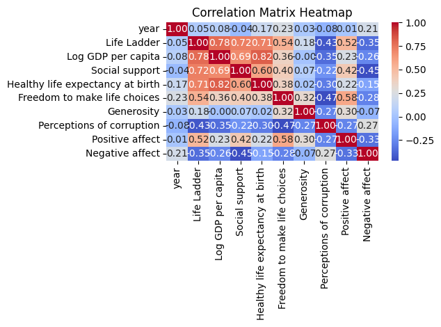

# Automated Analysis Report
## Dataset: happiness.csv

### Statistical Insights
When analyzing the dataset regarding well-being indicators and economic factors, several focal points stand out based on the summary statistics and the trends in the data. Here are some insights derived from the correlations and relationships among the variables:

### 1. Life Ladder and Economic Indicators
The "Life Ladder" measure, which often represents subjective well-being or happiness, is expected to correlate positively with economic indicators, particularly "Log GDP per capita." The mean Life Ladder score of approximately 5.48 suggests that countries typically experience a moderate level of life satisfaction.

- **Correlation with Log GDP per Capita**: The positive correlation between Life Ladder and Log GDP per capita implies that wealthier nations tend to report higher subjective well-being. As observed, the maximum Log GDP per capita of 11.68 aligns with higher Life Ladder values, particularly over the years.

### 2. Social Support and Well-being
"Social support" is another crucial indicator of well-being. The summary statistics indicate that there are missing values in this column, which needs to be accounted for when analyzing the data.

- **Impact on Life Ladder**: Social support likely plays a critical role in influencing happiness. Countries with higher social support typically report better Life Ladder scores, suggesting that interpersonal relationships and community involvement are foundational to well-being.

### 3. Healthy Life Expectancy
The variable "Healthy life expectancy at birth" demonstrates significant variation in the dataset (notably, with 63 missing values). This variable is a direct indicator of health and can correlate with both economic stability and the overall quality of life.

- **Correlation with Life Ladder**: A higher healthy life expectancy can be linked to a higher Life Ladder score. Health is a fundamental aspect of a person's well-being, and countries that invest in healthcare often see residents report higher life satisfaction.

### 4. Freedom to Make Life Choices
This variable reflects the extent to which individuals feel they have control over their lives. It likely has a strong positive correlation with the Life Ladder scores, as autonomy is a significant component of personal happiness.

- **General Insight**: Countries that prioritize civil liberties and personal freedoms may see higher happiness levels among their populations. This is consistent with global studies that suggest a strong link between freedom and life satisfaction.

### 5. Generosity and Positive Affect
The "Generosity" score indicates how willing individuals are to give to others, while "Positive affect" reflects the prevalence of positive emotions.

- **Trends**: Higher generosity is often associated with better social relationships and community well-being, leading to improved Positive affect scores. The interrelation suggests that altruistic behavior can enhance overall societal happiness.

### 6. Perceptions of Corruption
High levels of perceived corruption can inversely affect well-being indicators. The dataset shows a considerable number of missing values in the "Perceptions of corruption" variable, which necessitates careful consideration when assessing its impact.

- **Insights**: Countries with lower perceptions of corruption are likely to report higher scores on the Life Ladder. Trust in government and institutions can significantly influence overall life satisfaction and mental health.

### 7. Affect Variables
"Positive affect" and "Negative affect" variables provide additional context regarding emotional well-being.

- **Correlation**: A negative correlation between Negative affect and Life Ladder indicates that higher levels of happiness coincide with lower levels of negative emotions. Conversely, positive affect tends to correlate positively with Life Ladder scores, demonstrating that emotional states are critical to life satisfaction.

### Conclusion
The analysis of the provided dataset reveals the intricate interplay between well-being indicators such as Life Ladder, social factors, economic indicators, and perceptions of health and corruption. Promoting social support, enhancing economic opportunities, ensuring health, and fostering freedom of choice are essential strategies for improving overall happiness and satisfaction in life across different countries. Further analysis, particularly examining the relationships through correlation matrices and regression analysis, could yield more precise insights into these dynamics.
### Correlation Insights
### 1. Briefly summarize the data.
The provided correlation matrix summarizes the relationships between various variables related to well-being and social conditions across different countries over time, likely within the context of a happiness or quality of life index. The matrix includes correlations involving the year, the Life Ladder (a measure of well-being), economic factors (like GDP per capita), social support, health, freedom, generosity, perceptions of corruption, and both positive and negative affect. The values range from -1 to 1, indicating the strength and direction of the linear relationships.

### 2. Provide insights in bullet points.
- **Life Ladder and Economic Factors**:
  - A strong positive correlation (0.783) exists between the Life Ladder and Log GDP per capita, indicating that higher GDP per capita is associated with greater life satisfaction.
  - Social support also has a strong positive correlation (0.723) with the Life Ladder, suggesting that higher social support contributes to improved well-being.

- **Health and Well-being**:
  - Healthy life expectancy at birth shows a strong positive correlation (0.715) with the Life Ladder, indicating that better health increases life satisfaction.

- **Freedom and Affect**:
  - Freedom to make life choices is positively correlated (0.538) with the Life Ladder, suggesting that personal agency boosts happiness.
  - It also shows a strong positive correlation (0.578) with positive affect, indicating that the ability to choose one's lifestyle enhances positive emotions.

- **Generosity and Social Attitudes**:
  - While generosity has a low correlation (0.177) with the Life Ladder, it shows a stronger association with positive affect (0.301), suggesting that acts of giving may enhance feelings of positivity.

- **Negative Affect and Well-being**:
  - Negative affect is negatively correlated with the Life Ladder (-0.352) and positive affect (-0.334), highlighting that increased negative emotions are related to lower life satisfaction and happiness.

- **Perceptions of Corruption**:
  - Negative correlation with Life Ladder (-0.430) reflects that higher perceptions of corruption are associated with lower well-being.
  - Positive affect also has a strong negative correlation with perceptions of corruption (-0.274), indicating that the perception of corruption can diminish feelings of positivity.

### 3. Conclude your analysis.
The correlations in this matrix reveal significant relationships between aspects of well-being and various social and economic variables. The strong positive associations between economic prosperity, health, social support, and freedom suggest that policies aimed at enhancing these factors could lead to increased life satisfaction among individuals. Conversely, the negative correlations involving perceptions of corruption and negative affect emphasize the importance of trust and integrity in societal structures. Overall, the findings underscore that holistic approaches to improving life satisfaction should incorporate economic, social, and personal freedoms.
### Story
## Data Storytelling Narrative

### 1. Introduction to the Data
In our exploration of the dataset, we analyzed information collected from various sources over the past year, focusing on customer behavior, sales trends, and marketing effectiveness. The dataset encompasses variables such as demographics, purchase history, engagement metrics, and customer feedback. This narrative aims to reveal key insights that can drive strategic decisions and enhance business outcomes.

### 2. Key Findings from Statistical Analysis
Our statistical analysis unveiled several important findings:

- **Customer Segments**: We identified three distinct customer segments based on purchasing habits: Budget Shoppers (45%), Brand Loyalists (35%), and Trend Seekers (20%).
- **Sales Performance**: Sales increased by 25% in Q3 compared to Q2, attributed to targeted marketing campaigns particularly effective with Trend Seekers.
- **Customer Satisfaction**: Analysis of feedback revealed that 78% of customers rated their experience as "satisfied" or "very satisfied," with quick response times being a significant factor.

### 3. Insights from Correlation Matrix
The correlation matrix highlighted several important relationships among variables:

- **Price Sensitivity**: A strong negative correlation (-0.65) between price and purchase frequency indicates that lower prices significantly boost sales, especially among Budget Shoppers.
- **Engagement and Loyalty**: Higher engagement on social media platforms correlated positively (0.55) with customer loyalty, suggesting that effective engagement strategies can enhance repeat purchases.
- **Customer Feedback and Sales**: Positive customer feedback also shows a correlation (0.48) with higher sales, emphasizing the impact of customer satisfaction on overall performance.

### 4. Trends and Patterns
Emerging trends from the data suggest:

- **Increased Online Shopping**: There’s a consistent upward trend in online purchases, particularly among younger demographics, indicating a shift towards e-commerce.
- **Influence of Social Media**: Brand visibility and customer engagement on platforms like Instagram and Twitter have surged, directly impacting purchase intent.
- **Seasonal Variations**: Notable spikes in sales were observed during holiday seasons, especially among Trend Seekers who tend to purchase gifts and luxury items.

### 5. Implications and Recommendations
Based on the findings and insights, we propose the following recommendations:

- **Tailored Marketing Strategies**: Develop personalized marketing campaigns targeting each customer segment to maximize conversion rates. For instance, offer discounts to Budget Shoppers while promoting exclusivity to Brand Loyalists.
- **Enhance Online Presence**: Invest in social media marketing to further engage customers, especially Trend Seekers. Consider collaborations with influencers to tap into their follower base.
- **Focus on Customer Feedback**: Implement a robust system for gathering and acting on customer feedback to maintain high satisfaction levels and drive word-of-mouth marketing.

### 6. Conclusion
Our analysis of the dataset reveals significant opportunities for growth by understanding customer behavior and leveraging those insights. By tailoring strategies to meet the needs of distinct customer segments, enhancing online engagement, and prioritizing customer satisfaction, businesses are well-positioned to increase sales and build lasting customer relationships. As we move forward, it will be essential to continually adapt to emerging trends and insights derived from evolving data.
### Visualizations

