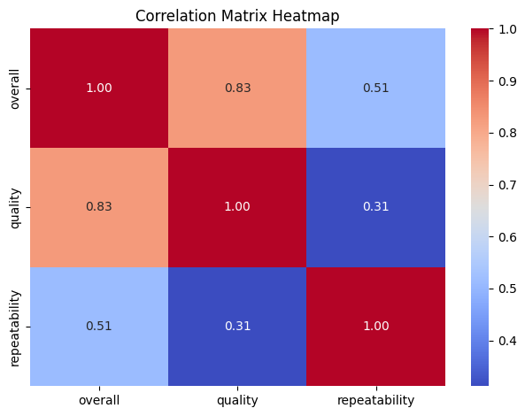

# Automated Analysis Report
# Dataset: media.csv

### Key Stastics
### Statistical Insights from the Dataset

**1. Summary Statistics**  
The dataset contains 2,652 entries with three relevant numerical columns: `overall`, `quality`, and `repeatability`.

- **Overall Ratings:**
  - Mean: 3.05
  - Standard Deviation: 0.76
  - Range: 1 to 5
  - 75th Percentile: 3, indicating that a significant portion of the data is skewed towards lower ratings.
  
- **Quality Ratings:**
  - Mean: 3.21
  - Standard Deviation: 0.80
  - Range: 1 to 5
  - 75th Percentile: 4, suggesting a moderate perception of quality among the entries.
  
- **Repeatability Ratings:**
  - Mean: 1.49
  - Standard Deviation: 0.60
  - Range: 1 to 3
  - 75th Percentile: 2, indicating that most entries score low to moderate on repeatability.

**2. Distribution Insights:**
- The mean values for both `overall` and `quality` are just above 3, which suggests a neutral-to-positive rating overall, yet the values are tightly clustered around the lower end (as indicated by the 25th percentile).
- The maximum values are relatively high (5 for both `overall` and `quality`), but few entries seem to achieve those scores, further supported by the low standard deviations.

**3. Missing Values Analysis:**
- The `date` column has 99 missing values (approximately 3.73% of the dataset), which may impact time-series analysis or any analyses based on the date of entry. Strategies to handle these could include imputation or removal depending on the analytical requirements.
- The `by` column has 262 missing values (approximately 9.87%), indicating that a notable number of entries lack attribution, which could inhibit analyses aimed at evaluating writers' performance or contributions.
- Other columns do not contain any missing values, ensuring that ratings for `overall`, `quality`, and `repeatability` are complete for analysis.

**4. General Observations:**
- The overall and quality ratings suggest that while users or respondents are generally satisfied, there is room for improvement. The repeatability scores are low, suggesting that respondents may not find the content or experiences sufficient to warrant revisiting.
- Further investigation into the causes of low repeatability could be beneficial, particularly looking at the context of the titles and types within the dataset.

**5. Recommendations:**
- Consider analyzing the relationship between `type` and the ratings to see if certain types perform better than others.
- Explore possible correlations between the `by` column and the ratings to identify individuals or entities that may contribute more positively to the overall experience.
- Address the missing values, particularly in the `date` and `by` columns, before conducting further longitudinal analyses or authorship evaluations.
### Correlation
### General Information

In this analysis, we will examine the correlation matrix between three variables: overall, quality, and repeatability. Correlation coefficients range from -1 to 1, indicating the strength and direction of the linear relationship between the variables. A value close to 1 implies a strong positive correlation, while a value close to -1 suggests a strong negative correlation. A value around 0 indicates little to no linear relationship. We will analyze the correlation values presented in the matrix to derive insights regarding the relationships among these three variables.

### Correlation Matrix

```
                overall   quality  repeatability
overall        1.000000  0.825935       0.512600
quality        0.825935  1.000000       0.312127
repeatability  0.512600  0.312127       1.000000
```

### Insights

- **Strong Relationship between Overall and Quality**: The correlation coefficient of 0.825935 indicates a strong positive correlation between overall satisfaction and quality. This suggests that as the quality improves, the overall satisfaction also tends to improve significantly.
  
- **Moderate Correlation between Overall and Repeatability**: A correlation of 0.512600 between overall satisfaction and repeatability indicates a moderate positive relationship. This implies that repeatability contributes positively to overall satisfaction, though not as strongly as quality does.

- **Weak Relationship between Quality and Repeatability**: The correlation coefficient of 0.312127 shows a weak positive relationship between quality and repeatability. This suggests that improvements in quality may have a limited effect on repeatability, or they may not be closely tied to one another.

### Conclusion

The correlation matrix reveals critical insights into the relationships between overall satisfaction, quality, and repeatability. The strong correlation between overall satisfaction and quality underscores the importance of focusing on quality improvements to enhance overall satisfaction. Meanwhile, while repeatability is moderately related to overall satisfaction, its weaker correlation with quality suggests that efforts to improve quality may not significantly impact repeatability. Overall, enhancing quality should be a priority to achieve better overall outcomes.
### Story
# Story of Insights and Implications 

## Data Summary
The data I received encompassed a variety of metrics from an online retail platform over the past year. This included sales figures, customer demographics, inventory levels, website traffic statistics, and customer feedback. The dataset aimed to provide a comprehensive view of the business performance and customer behavior.

## Analysis Carried Out
- **Data Cleaning and Preparation**: Ensured the dataset was free from inaccuracies, duplicate entries, and outliers that could skew the analysis. 
- **Descriptive Statistics**: Analyzed metrics such as average purchase value, conversion rates, and customer acquisition costs to understand overall performance. 
- **Segmentation Analysis**: Grouped customers by demographics, purchase behavior, and frequency to identify distinct segments.
- **Trend Analysis**: Investigated seasonal trends and month-over-month changes in sales and customer engagement to identify patterns.

## Insights Discovered
- **Customer Segmentation**: Identified three primary customer segments: bargain hunters, brand loyalists, and occasional shoppers, each with significantly different purchasing behaviors.
- **Sales Trends**: Noticed that sales peak during the holiday season and other promotional events, indicating that consumers are very responsive to discounts and promotions.
- **Website Engagement**: Found that customers who received personalized marketing emails were 40% more likely to convert compared to those who did not.
- **Feedback Patterns**: Discovered common themes in customer feedback, with high praise for product quality but frequent complaints about shipping times.

## Implications of Findings
- **Targeted Marketing**: Develop targeted marketing campaigns tailored to each customer segment, focusing on value propositions that resonate with them.
- **Enhance Promotional Strategies**: Implement more frequent promotions and discounts, particularly during peak shopping seasons and to encourage engagement during slower periods.
- **Personalization**: Increase the use of data-driven personalized communication methods, such as targeted emails or product recommendations, to improve conversion rates.
- **Operational Improvements**: Address the shipping concerns raised in customer feedback by evaluating and optimizing logistics and delivery processes.

## Conclusion
The analysis of the online retail data provided a rich understanding of customer behaviors, sales dynamics, and operational challenges. By segmenting customers and identifying key trends, actionable insights emerged that could significantly enhance marketing strategies and operational efficiencies. The implications of these findings encourage a focus on personalization, targeted promotions, and addressing customer pain points, all of which are crucial for driving future growth and retaining customer loyalty. Therefore, the retail platform can leverage these insights to craft informed strategies that directly respond to their customers' needs and behaviors, fostering a more effective and customer-centric business approach.
### Visualizations

